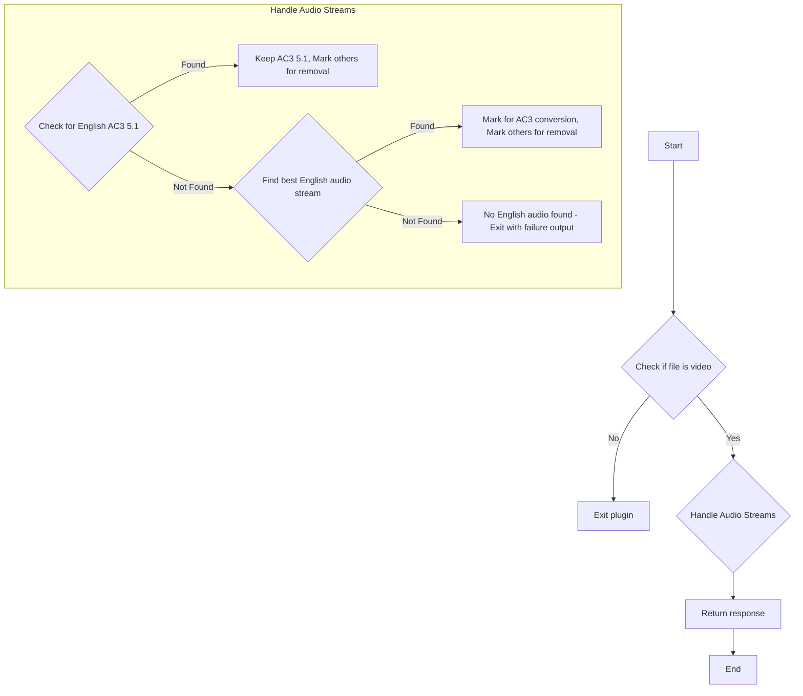
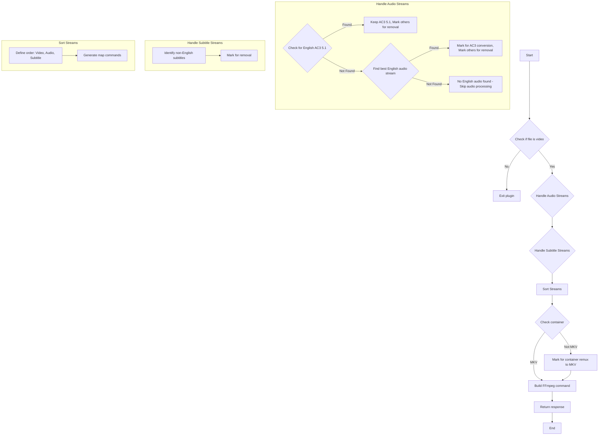
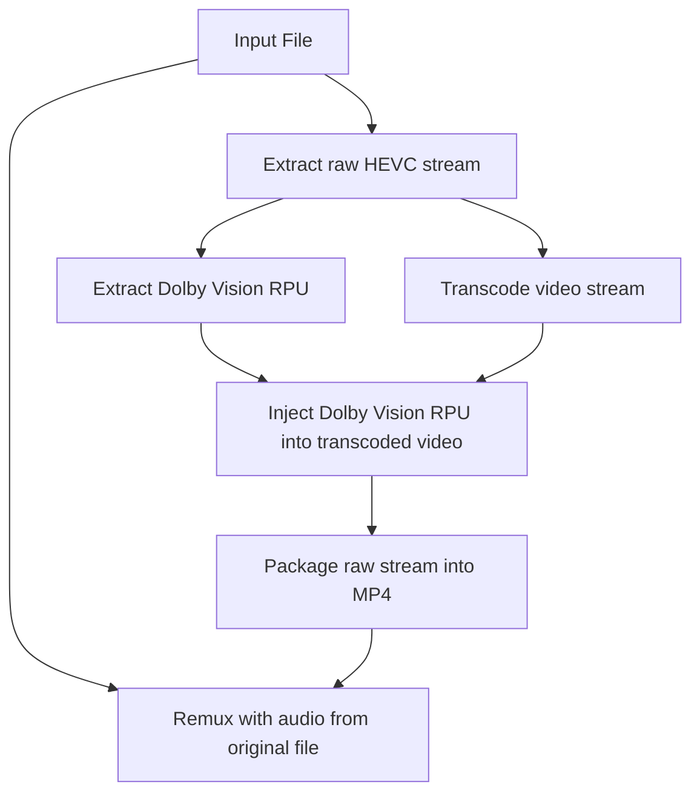

# Tdarr_Plugins - Extended Collection

This repository contains an extended collection of Tdarr plugins, including a custom AC3 Audio Stream Handler and a suite of plugins for processing Dolby Vision and HDR content.

## Development

This section outlines the general development setup for working with Tdarr plugins.

Make sure NodeJS v16 is installed.

Install dependencies:

```bash
npm install
```

Run ESLint:

```bash
npm run lint:fix
```

Check plugins using some extra custom rules:

```bash
npm run checkPlugins`
```

Run tests:

```bash
npm run test
```

## Using Plugins from This Repository

To use the plugins from this repository in Tdarr:

1.  Change the `Community plugins repository` option in the Tdarr options tab to `https://github.com/jakezp/Tdarr_Plugins/archive/master.zip`.
2.  Restart the Tdarr server and then the nodes. Tdarr will pull the plugins from the specified repository.

For detailed steps on writing and developing Tdarr Flow plugins within this repository:

1.  Clone this repo.
3.  Browse the typescript plugins here `FlowPluginsTs/CommunityFlowPlugins/` and make edits locally or create a new one locally.
4.  Make sure typescript is installed with `npm i -g typescript` then run `tsc` to compile the changes.
5.  Commit the changes so Tdarr will pick up the new plugins in `https://github.com/jakezp/Tdarr_Plugins/archive/master.zip`
  - If Tdarr is running locally, Set env variable pluginsDir to the location of the plugins repo and run Tdarr Server and Node. E.g. export `pluginsDir=path_to/Tdarr_Plugins`

Note, `pluginsDir` directories that contain a `.git` folder (such as when cloning this repo) will cause Tdarr to skip plugin updates to prevent overwriting development changes.

## Audio and Media Stream Handlers

### AC3 Audio Stream Handler (Audio-Only Version)

This plugin focuses solely on audio stream handling, ensuring a single English AC3 audio stream in media files.

The plugin is located at `FlowPluginsTs/CommunityFlowPlugins/audio/ac3AudioStreamHandler/1.0.0/`.

The Flow Plugin provides the following configurable inputs:

* **Keep Only English AC3:** If true, only keep one English AC3 audio stream and remove all others.

The plugin follows this workflow:



The plugin has two outputs:
* **Output 1:** Success (audio processed or no processing needed)
* **Output 2:** Failure (no English audio stream found)

### Simple Media Stream Handler (Full Version)

This plugin provides comprehensive media stream handling, including audio streams, subtitle streams, and container format.

The plugin is located at `FlowPluginsTs/CommunityFlowPlugins/media/simpleMediaStreamHandler/1.0.0/`.

The Flow Plugin provides the following configurable inputs:

* **Keep Only English AC3:** If true, only keep one English AC3 audio stream and remove all others.
* **Remove Non-English Subtitles:** If true, remove all non-English subtitle streams.
* **Convert to MKV:** If true, convert the container to MKV.

The plugin follows this general workflow:



Note - A similar Classic Plugin (`Tdarr_Plugin_CUSTOM_AC3_Audio_Stream_Handler.js`) is also available in the `Community/` directory.

## HDR Detection Plugins

This repository includes three different HDR detection plugins, each with varying capabilities and detection methods:

### 1. Check HDR Video (Basic)

**Location:** `FlowPluginsTs/CommunityFlowPlugins/video/checkHdr/1.0.0/`

This is the original basic HDR detection plugin that uses a strict set of criteria to identify HDR10 content:

- Requires `color_transfer` to be exactly "smpte2084" (PQ/HDR10)
- Requires `color_primaries` to be exactly "bt2020"
- Requires `color_range` to be exactly "tv"

**Outputs:**
- **Output 1:** File is HDR
- **Output 2:** File is not HDR

**Use case:** Simple binary HDR/SDR detection when you only need to know if a file is HDR10 and don't need to distinguish between different HDR formats.

**Limitations:** May not detect some valid HDR files if they don't have all three metadata fields set exactly as expected. Does not detect Dolby Vision, HDR10+, or HLG.

### 2. Check HDR Type (Extended)

**Location:** `FlowPluginsTs/CommunityFlowPlugins/video/checkHDRType/1.0.0/`

This is an extended version of the original plugin that can detect different HDR formats:

- Uses the same criteria as the basic plugin for HDR10 detection
- Additionally checks MediaInfo data for Dolby Vision and HDR10+

**Outputs:**
- **Output 1:** File is Dolby Vision
- **Output 2:** File is HDR10+
- **Output 3:** File is HDR10
- **Output 4:** File is not HDR

**Use case:** When you need to distinguish between Dolby Vision, HDR10+, and HDR10 content to handle them differently in your workflow.

**Limitations:** Still uses strict criteria for HDR10 detection and may miss some valid HDR files. Limited detection methods for Dolby Vision and HDR10+.

### 3. Improved Check HDR Type (Comprehensive)

**Location:** `FlowPluginsTs/CommunityFlowPlugins/video/improvedCheckHDRType/1.0.0/`

This is a comprehensive HDR detection plugin that uses multiple detection methods to ensure accurate identification:

- Checks for Dolby Vision using side data configuration records
- Looks for HDR format information in MediaInfo
- Examines color transfer functions, primaries, and spaces
- Checks for HDR metadata (master_display, light level info)
- Supports HLG detection

**Outputs:**
- **Output 1:** File is Dolby Vision
- **Output 2:** File is HDR10+
- **Output 3:** File is HDR10
- **Output 4:** File is HLG
- **Output 5:** File is SDR

**Use case:** When you need the most accurate and comprehensive HDR detection, especially for files with incomplete or non-standard metadata. This plugin is recommended for most workflows.

**Advantages:**
- More reliable detection of all HDR formats
- Detailed logging of which detection method succeeded
- Support for HLG format
- Multiple fallback detection methods

## Dolby Vision / HDR Related Plugins

This suite of plugins provides the ability to transcode Dolby Vision videos and remux them into MP4s compatible with devices like LG TVs.

The core motivation is to address the lack of Dolby Vision playback from MKV containers on certain devices and to enable downscaling of 4K Dolby Vision content to 1080p while preserving the Dolby Vision metadata.

### Dolby Vision Profile Detector

This plugin analyzes video files to detect if they contain Dolby Vision and identifies the specific profile.

The plugin is located at `FlowPluginsTs/CommunityFlowPlugins/video/doviProfileDetector/1.0.0/`.

Features:
- Detects Dolby Vision profiles 4, 5, 7, and 8
- Outputs to different paths based on the detected profile

The plugin has five outputs:
- **Output 1:** DolbyVision - profile 4
- **Output 2:** DolbyVision - profile 5
- **Output 3:** DolbyVision - profile 7
- **Output 4:** DolbyVision - profile 8
- **Output 5:** No DolbyVision/SDR

### Libplacebo Colorspace Correction

This plugin applies libplacebo for colorspace and tonemapping fixes, especially useful for Dolby Vision content.

The plugin is located at `FlowPluginsTs/CommunityFlowPlugins/video/libplaceboColorspaceCorrection/1.0.0/`.

Features:
- Fixes colorspace issues in HDR and Dolby Vision content
- Applies tonemapping for proper display on SDR devices
- Configurable parameters for colorspace, primaries, and transfer characteristics
- Optional Dolby Vision processing
- Adjustable contrast recovery and tonemapping settings
- Supports various video codecs (NVENC and CPU-based)

The plugin provides the following configurable inputs:
- **Colorspace:** Target colorspace for the output video
- **Color Primaries:** Target color primaries for the output video
- **Color Transfer Characteristics:** Target transfer characteristics for the output video
- **Tonemapping Algorithm:** Algorithm to use for HDR to SDR conversion
- **Apply Dolby Vision:** Whether to apply Dolby Vision processing
- **Gamut Mode:** Color gamut mapping mode
- **Contrast Recovery:** Contrast recovery value (0.0-1.0)
- **Tonemapping LUT Size:** Size of the tonemapping lookup table
- **Video Codec:** Video codec to use for encoding
- **Encoding Preset:** Encoding preset (p1=slowest/best quality, p7=fastest/worst quality)
- **CQ/CRF Value:** Constant quality value (lower = better quality)

Example command:
```sh
tdarr-ffmpeg -i "input.mkv" -map 0:v -map 0:a -vf "libplacebo=colorspace=bt709:color_primaries=bt709:color_trc=bt709:tonemapping=4:apply_dolbyvision=true:gamut_mode=1:contrast_recovery=0.6:tonemapping_lut_size=256" -c:v hevc_nvenc -preset p4 -cq 18 -c:a copy "output.mp4"
```

The process for handling Dolby Vision content involves several steps, often chained together in a Tdarr flow:



This process is based on the [dvmkv2mp4](https://github.com/gacopl/dvmkv2mp4) tool and writeup by [@gacopl](https://github.com/gacopl).

### Key Plugins:

*   **Extract Streams (`FlowPluginsTs/CommunityFlowPlugins/ffmpegCommand/ffmpegCommandExtractStreams/1.0.0/`):**
    Responsible for extracting the HEVC stream and saving it in the working directory with the same name as the original file but with `.hevc` extension. It will also extract all ASS and SRT subtitles and save them as `.srt` files in the `sub_streams` folder in the working directory for later use. The subtitle files will be annotated with their metadata (language, forced, sdh, default) that will be picked up by Jellyfin. The plugin also supports filtering subtitles based on language.

    **Important:** to reorder streams before this plugin and have the video stream as the last stream. This is because all the subtitle streams have their own outputs defined in the middle of the ffmpeg command. Tdarr handles streams in order when building the ffmpeg command parameters and the video stream if not the last will not be matched to the proper output.

    <details>
    <summary>Example command</summary>

    ```sh
    tdarr-ffmpeg -y \
        -i /path/to/input.mkv \
        -map 0:3 -c:s:0 copy /temp/tdarr-workDir-node-J2D7FNt5O-worker-open-ox-ts-1710332442638/sub_streams/2.hun.default.forced.srt \
        -map 0:4 -c:s:0 copy /temp/tdarr-workDir-node-J2D7FNt5O-worker-open-ox-ts-1710332442638/sub_streams/3.hun.srt \
        -map 0:5 -c:s:0 copy /temp/tdarr-workDir-node-J2D7FNt5O-worker-open-ox-ts-1710332442638/sub_streams/4.eng.srt \
        -map 0:6 -c:s:0 copy /temp/tdarr-workDir-node-J2D7FNt5O-worker-open-ox-ts-1710332442638/sub_streams/5.eng.sdh.srt \
        -map 0:0 -c:v copy -bsf:v hevc_mp4toannexb /temp/tdarr-workDir-node-J2D7FNt5O-worker-open-ox-ts-1710332442638/1710332450149/input.hevc
    ```
    </details>

*   **Extract DoVi RPU (`FlowPluginsTs/CommunityFlowPlugins/video/extractDoViRpu/1.0.0/`):**
    Responsible for extracting Dolby Vision RPU data. To achieve this [dovi_tool](https://github.com/quietvoid/dovi_tool) is needed. The plugin will extract the RPU data from the HEVC stream and save it to the working directory as a `.rpu.bin` file for later use.

    <details>
    <summary>Example command</summary>

    ```sh
    /usr/local/bin/dovi_tool \
        -c \    # Crop, remove letterbox
        -m 2 \  # Mode 2, converts the RPU to be profile 8.1 compatible.
        extract-rpu /shows/Transcode/tdarr-workDir-node-J2D7FNt5O-worker-open-ox-ts-1710332442638/1710332450149/input.hevc
        -o /temp/tdarr-workDir-node-J2D7FNt5O-worker-open-ox-ts-1710332442638/dovi_tool/input.rpu.bin
    ```
    </details>

*   **Inject DoVi RPU (`FlowPluginsTs/CommunityFlowPlugins/video/injectDoViRpu/1.0.0/`):**
    Responsible for injecting the RPU data back into the video stream. The process is the reverse of extracting Dolby Vision RPU using [dovi_tool](https://github.com/quietvoid/dovi_tool) again. Inject the previously saved RPU data from the `.rpu.bin` file, injects it into the transcoded stream from the previous step and save the resulting video stream as an `.rpu.hevc` file in the workspace.

    <details>
    <summary>Example command</summary>

    ```sh
    /usr/local/bin/dovi_tool \
        -i /shows/Transcode/tdarr-workDir-node-J2D7FNt5O-worker-open-ox-ts-1710332442638/1710332520936/input.hevc \ # Transcoded video from previous step
        --rpu-in /temp/tdarr-workDir-node-J2D7FNt5O-worker-open-ox-ts-1710332442638/dovi_tool/input.rpu.bin \
        extract-rpu /shows/Transcode/tdarr-workDir-node-J2D7FNt5O-worker-open-ox-ts-1710332442638/1710332450149/input.hevc \
        -o /temp/tdarr-workDir-node-J2D7FNt5O-worker-open-ox-ts-1710332442638/1710333079164/input.rpu.hevc
    ```
    </details>

*   **Package DoVi mp4 (`FlowPluginsTs/CommunityFlowPlugins/video/packageDoViMp4/1.0.0/`):**
    For better compatibility, this plugin uses [MP4Box](https://wiki.gpac.io/MP4Box/MP4Box/) to package the stream into an mp4 container. Anecdotally MP4Box handles this better than ffmpeg, at least at the time of writing. This resulting mp4 will only have the video stream in it, it will be used in the next step along with the audio streams from the input file to remux into the final form.

    <details>
    <summary>Example command</summary>

    ```sh
    /usr/local/bin/MP4Box \
        -add /temp/tdarr-workDir-node-J2D7FNt5O-worker-open-ox-ts-1710332442638/1710333079164/input.rpu.hevc:dvp=8.1:xps_inband:hdr=none \
        -tmp /temp/tdarr-workDir-node-J2D7FNt5O-worker-open-ox-ts-1710332442638/1710333091979/tmp \
        -brand mp42isom \
        -ab dby1 \
        -no-iod \
        -enable 1 \
        /temp/tdarr-workDir-node-J2D7FNt5O-worker-open-ox-ts-1710332442638/1710333091934/input.rpu.hevc.mp4
    ```
    </details>

*   **Remux DoVi MP4 (`FlowPluginsTs/CommunityFlowPlugins/ffmpegCommand/ffmpegCommandRemuxDoviMp4/1.0.0/`):**
    Responsible for creating the right ffmpeg arguments to mux the correct streams together. The plugin will take the video stream from the mp4 file created in the previous step and mux it together with the audio streams from the original file. There are a couple of extra steps involved here: TrueHD audio streams are dropped as ffmpeg support for them in mp4 containers is experimental and I couldn't get it to work properly. Also metadata is copied from the original file.

    Stream titles are handled differently in mp4 containers than in mkv, to deal with this the original audio stream titles are mapped to the `handler_name` metadata tag in the output file as Jellyfin will use that to read stream titles as a fallback.

    Chapter data is copied as part of the metadata, but chapter titles are dropped as it will result in a data stream in the output file which I found to cause playback issues.

    <details>
    <summary>Example command</summary>

    ```sh
    tdarr-ffmpeg -y \
        -i /temp/tdarr-workDir-node-J2D7FNt5O-worker-open-ox-ts-1710332442638/1710333091934/input.rpu.hevc.mp4 \
        -i /path/to/input.mkv \ # Original file
        -map 0:0 -c:0 copy \    # Copy video from the previous mp4
        -map 1:a -c:a copy \    # Copy audio from original file
        -map_metadata 1 \       # Copy metadata from original file
        -map_metadata:c -1 \    # Drop chapter titles
        -dn \                   # Drop data streams
        -movflags +faststart \  # Add fast start flag, not strictly necessary
        -strict unofficial \    # Dolby Vision support is behind this flag
        /temp/tdarr-workDir-node-J2D7FNt5O-worker-open-ox-ts-1710332442638/1710333113706/input.mp4
    ```
    </details>

    This plugin can also handle remuxing an input mkv file into a playable mp4 file without transcoding the video. Use the [Set Container](FlowPluginsTs/CommunityFlowPlugins/ffmpegCommand/ffmpegCommandSetContainer/1.0.0/index.ts) plugin before to set the container to mp4 then this plugin to remux. Same as previously TrueHD audio streams are dropped and metadata is copied and mapped for audio streams.

    It is recommended to extract subtitle streams beforehand to keep them using the [Move Folder Content to Blackhole](#move-folder-content-to-blackhole) plugin.

    <details>
    <summary>Example command (Remux only)</summary>

    ```sh
    tdarr-ffmpeg -y \
        -i /path/to/input.mkv \
        -map 0:0 -c:0 copy \
        -map 0:1 -c:1 copy \
        -map 0:2 -c:2 copy \
        -map_metadata 0 \
        -map_metadata:c -1 \
        -bsf:v hevc_mp4toannexb \
        -dn \
        -movflags +faststart \
        -strict unofficial \
        /temp/tdarr-workDir-node-J2D7FNt5O-worker-mean-moose-ts-1710205452909/1710205516754/input.mp4
    ```
    </details>

*   **Parse file with Radarr or Sonarr (`FlowPluginsTs/CommunityFlowPlugins/tools/parseFileWithRadarrOrSonarr/1.0.0/`):**
    Used to get additional info about the input file from Sonarr / Radarr. The library is handled by these two, so it's safe to assume they will have additional info about the files. The plugin will save the info in a file named `arr.json` in the working directory.

    ```json
    {
      "fileId": 1234,
      "originalPath": "/path/to/input.mkv",
      "releaseGroup": "AWESOMERLS",
      "sceneName": "My.Input.Movie.SceneName.2042.1080p.BluRay.x264-AWESOMERLS"
    }
    ```

    Configuration can be provided using library variables. These can be referenced in the plugin input like this: `{{{args.userVariables.library.arr_host}}}`.

*   **Wait for rename from Radarr or Sonarr (`FlowPluginsTs/CommunityFlowPlugins/tools/getNewPathFromRadarrOrSonarr/1.0.0/`):**
    Responsible for checking in with Sonarr or Radarr to check if the transcoded file was imported properly. The purpose of this is to set the output path of the plugin flow in Tdarr to the path *arr imported the file to as they are handling naming for library files, Tdarr has no way of knowing the resulting filename. It will wait until the path *arr is reporting for the file is changed from the original path was, as read from `arr.json`.

    It will try a certain number of times and wait for a set time between tries, both can be configured. It also support path mapping as the path known to *arr might be different than what Tdarr is using, this can be configured using the `path_mapping_from` (path used by *arr) and `path_mapping_to` (path used by Tdarr) parameters. Same configuration recommendation goes as for Parse file with Radarr or Sonarr.

*   **Move Folder Content to Blackhole (`FlowPluginsTs/CommunityFlowPlugins/file/moveToBlackhole/1.0.0/`):**
    Responsible for moving the given file and previously extracted subtitle streams from `sub_streams` into the specified blackhole folder. It will also grab all files matching the specified extension (`.srt` for example) in the original folder and copy those to the blackhole folder as well. This is important in the case of handling mp4 files for example which would loose the associated external subtitles unless copied.

    It will also change the release group on the file to `TDARR`, this is useful for making sure *arr always imports these files by setting it with a higher custom score.

    The goal of this plugin is to put all the appropriate content in a folder watched by a blackhole downloader of Sonarr or Radarr. For this to work, specific configuration is needed on the *arr side (blackhole downloader, custom format matching `TDARR` with a positive score).

*   **Check DoVi Profile (`FlowPluginsTs/CommunityFlowPlugins/video/checkDoViProfile/1.0.0/`):**
    Responsible for determining the Dolby Vision profile of the given file. As mentioned in the How it works section, this setup doesn't support profile 7, so it is important to determine the profile used by the file.

## Required Tools

MP4Box and dovi_tool are not part of the official Tdarr image. To solve this [@andrasmaroy](https://github.com/andrasmaroy) [extended](https://github.com/andrasmaroy/Tdarr_Plugins_DoVi/blob/master/docker/Dockerfile) the official image with these tools. It is available at [packages](https://github.com/andrasmaroy/Tdarr_Plugins_DoVi/pkgs/container/tdarr_node). I've updated the [Dockerfile](https://github.com/jakezp/tdarr_dovi) to use the latest version of Tdarr, MP4Box and dovi_tool, and it's available [here](https://hub.docker.com/repository/docker/jakezp/tdarr_dovi).

## Acknowledgements

*   The Dolby Vision / HDR related plugins and significant portions of this README are based on the excellent work by [@andrasmaroy](https://github.com/andrasmaroy) in the [Tdarr_Plugins_DoVi](https://github.com/andrasmaroy/Tdarr_Plugins_DoVi) repository.
*   The Dolby Vision processing approach is based on the [dvmkv2mp4](https://github.com/gacopl/dvmkv2mp4) tool and writeup by [@gacopl](https://github.com/gacopl).
*   This repository is an extension of the original [Tdarr_Plugins](https://github.com/HaveAGitGat/Tdarr_Plugins) repository by [@HaveAGitGat](https://github.com/HaveAGitGat).

## References
*Updated, but mostly as referenced in the original README.md files*

*   [@HaveAGitGat's original Tdarr_Plugins](https://github.com/HaveAGitGat/Tdarr_Plugins) repo
*   [@andrasmaroy](https://github.com/andrasmaroy/Tdarr_Plugins_DoVi)
*   [dvmkv2mp4](https://github.com/gacopl/dvmkv2mp4) - Convert any Dolby Vision/HDR10+ MKV to MP4 that runs on many devices
*   [dovi_tool](https://github.com/quietvoid/dovi_tool)
*   [MP4Box](https://wiki.gpac.io/MP4Box/MP4Box/)
*   [Discard data stream from container using ffmpeg](https://stackoverflow.com/a/60374650) - chapter titles creating a data stream in mp4s, how to drop that
*   Couple of reddit posts:
    *   How HDR works [post 1](https://old.reddit.com/r/ffmpeg/comments/s3cfsd/is_this_ffmpeg_command_retaining_hdr_4k_hevc_hdr/hslgohc/), [post 2](https://old.reddit.com/r/ffmpeg/comments/rv3sm5/downscaling_4k_hdr_10bit_to_1080p_but_maintaining/hr4omtp/), [post 3](https://old.reddit.com/r/ffmpeg/comments/wgols5/how_to_downscale_from_proper_4k_to_1080p_keeping/)
    *   [Dolby Vision from MKV to MP4 using ffmpeg and mp4muxer](https://old.reddit.com/r/ffmpeg/comments/qe7oq1/dolby_vision_from_mkv_to_mp4_using_ffmpeg_and/)
    *   [Trigger Radar to Rename after Transcode](https://old.reddit.com/r/Tdarr/comments/wlrksm/trigger_radar_to_rename_after_transcode/) - Setting up blackhole downloader in *arr in conjunction with Tdarr
    *   [Convert DV Profile 7 to 8.1 using dovi_tool, mp4box and ffmpeg](https://old.reddit.com/r/ffmpeg/comments/11gu4o4/convert_dv_profile_7_to_81_using_dovi_tool_mp4box/jn5gman/)
*   [Encoding UHD 4K HDR10 and HDR10+ Videos](https://codecalamity.com/encoding-uhd-4k-hdr10-videos-with-ffmpeg/#saving-dolby-vision) - Detailing the process of downscaling HDR videos
*   [ffmpeg and hevc_qsv Intel Quick Sync settings](https://nelsonslog.wordpress.com/2022/08/22/ffmpeg-and-hevc_qsv-intel-quick-sync-settings/) - Quality settings for Quick Sync
*   [ffmpeg Quick Sync documentation](https://trac.ffmpeg.org/wiki/Hardware/QuickSync)